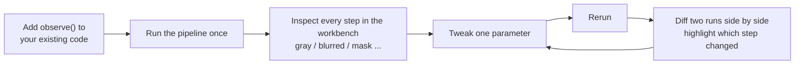
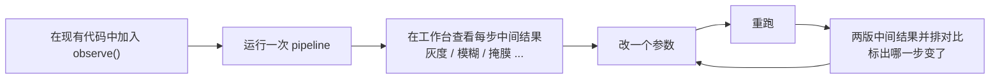

# ProofRun

> **This repository has moved.** Active development continues at **[Loopvera/Loopvera](https://github.com/Loopvera/Loopvera)**. Please use the new repository for issues, contributions, and releases.
>
> **本仓库已迁移。** 后续开发请前往 **[Loopvera/Loopvera](https://github.com/Loopvera/Loopvera)**。问题反馈、贡献与发布均在新仓库进行。

---

## English

**ProofRun Vision** brings commercial-grade runtime debugging to open-source vision pipelines. Add `observe()` to your **OpenCV / NumPy / PyTorch / OpenMMLab / custom** code to capture every intermediate step, tweak a parameter and rerun, then **diff two runs side by side**. Library-agnostic, replayable, and free—it plugs into existing code without replacing operators. When debug folders fill with `debug_003_v2_final.png`, the gap is tooling, not algorithms. Install via `pip install proofrun-vision`, run once, then open the local workbench in your browser. Vision is the first domain on a neutral runtime-evidence substrate, extensible to embedded and signal workflows.

### Workflow

---

## 简体中文

**ProofRun Vision** 把「商业视觉软件级」的运行时调试带给开源视觉栈：在 **OpenCV / NumPy / PyTorch / OpenMMLab / 自研算子** 代码里加入 `observe()`，看清每一步中间结果，改一个参数重跑，把两次运行**并排对比**。**库无关**、可回放、免费，挂在你现有代码上，不替代任何算子。测试集掉点、文件夹堆满 `debug_003_v2_final.png` 时，缺的多是开发工具而非算法。ProofRun 只补「看清 → 改参重跑 → 跨次对比」这一层。`pip install proofrun-vision` 安装，跑一次 pipeline 后，用浏览器打开本地工作台即可。

### 使用流程

---

*Run with proof.*
